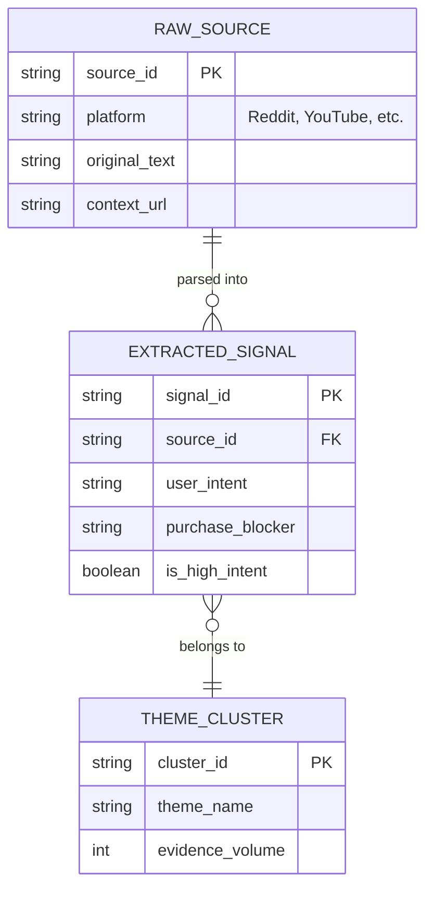

# AI-Powered Discovery Engine: System Architecture

---

## 1. Architectural Vision & Scope

The Discovery Engine is a backend analysis and insight-generation system designed to process unstructured Voice of Customer (VoC) data from specific public channels. Its sole purpose is to convert raw conversations into structured, evidence-backed insights regarding why users abandon their Myntra wishlists, without proposing final product solutions.

### 1.1 Core Constraints
- **Allowed Data Sources**: Apple App Store, Google Play Store, Reddit, YouTube.
- **Text-Data Only**: The system processes exclusively textual data. No noise, sound, audio, or images are used.
- **Strictly Discovery**: The system focuses purely on extracting behavioral barriers, unmet needs, and decision friction. It does not generate or deploy end-user features.
- **Evidence Traceability**: Every insight must maintain a verifiable link back to the raw source data.

---

## 2. End-to-End Analysis Pipeline

The system is designed as a sequential, multi-stage data processing pipeline.

```mermaid
flowchart TD
    subgraph Stage1["1. Source Ingestion Layer"]
        A1["Apple App Store API"]
        A2["Google Play Store API"]
        A3["Reddit Scraper (PRAW/Apify)"]
        A4["YouTube Data API v3"]
    end

    subgraph Stage2["2. Preprocessing & Normalization"]
        B1["Deduplication & Noise Removal"]
        B2["PII Scrubbing"]
        B3["Text Normalization (e.g., Hinglish Parsing)"]
    end

    subgraph Stage3["3. Relevance & Intent Filtering"]
        C1["LLM Relevance Filter<br/>(Keeps only fashion/shopping/wishlist contexts)"]
    end

    subgraph Stage4["4. Extraction Engine"]
        D1["Intent & Behavior Extraction<br/>(Purchase vs. Bookmarking)"]
        D2["Pain-Point & Blocker Extraction<br/>(e.g., Size anxiety, Price ambiguity)"]
        D3["Workaround & Alternative Consideration"]
    end

    subgraph Stage5["5. Clustering & Segmentation"]
        E1["Semantic Embeddings (e.g., text-embedding-3)"]
        E2["Thematic Clustering (HDBSCAN)"]
        E3["User & Context Segmentation"]
    end

    subgraph Stage6["6. Quantification & Output"]
        F1["Evidence Quantification Engine<br/>(Volume & Prevalence Calculation)"]
        F2["Prioritization Matrix Scoring"]
        F3["Structured Discovery Report Generation"]
    end

    Stage1 --> Stage2
    Stage2 --> Stage3
    Stage3 --> Stage4
    Stage4 --> Stage5
    Stage5 --> Stage6
```

---

## 3. Component Details

### 3.1 Source Collection Layer
Dedicated connectors for the four permitted sources:
- **Play Store / App Store**: Fetching reviews filtered by keywords (e.g., "wishlist", "save", "cart", "buy", "size").
- **Reddit**: Ingesting threads from `r/IndianFashionAddicts` and `r/TwoXIndia` focusing on product evaluation, sizing, and styling advice.
- **YouTube**: Scraping comments from Myntra try-on hauls and fashion influencer lookbooks.

### 3.2 Data Cleaning & Relevance Layer
- **Sanitization**: Removes emojis, spam, and Personally Identifiable Information (PII).
- **Hinglish Support**: Standardizes code-mixed Indian English and colloquial expressions (e.g., "kapda patla hai" -> "fabric is thin").
- **Relevance Gate**: An initial lightweight LLM prompt or classifier to discard irrelevant comments (e.g., video production quality) and retain only purchase-decision-related texts.

### 3.3 Core LLM Extraction Layer
This is the intelligence core of the engine, using structured LLM outputs (e.g., JSON schema) to parse each relevant comment for:
- **User Intent**: Differentiating genuine purchase intent from casual bookmarking.
- **Purchase Blocker**: Specifically identifying what stopped the checkout.
- **Information Need**: What data the user is seeking (e.g., realistic photos, exact measurements).

### 3.4 Clustering & Quantification Engine
- **Vectorization**: Unstructured extractions are converted into dense vector embeddings.
- **Clustering**: Algorithms group similar vectors to surface recurring themes (e.g., "Inconsistent sizing across Western wear").
- **Quantification**: Calculates the relative volume of these clusters against the total relevant dataset to provide interpretable prevalence metrics (e.g., "15% of fit-related hesitation is tied to bust measurement ambiguity").

---

## 4. Data Storage & Traceability Architecture

To meet the "Evidence and Trust Requirements", the data model ensures high traceability.

- **PostgreSQL**: Stores the relational mapping from raw sources to extracted signals and final clusters, ensuring any PM can click a theme and see the exact Reddit comments or App Store reviews that generated it.
- **Vector DB (e.g., ChromaDB/Qdrant)**: Stores embeddings for semantic search and clustering.

---

## 5. Output Interface (PM Discovery Dashboard)

The final output is not a consumer-facing app, but an internal reporting structure that outputs:
1. **Executive Summaries**: High-level overviews of top friction areas.
2. **Evidence Tables**: Raw verbatim quotes linked to specific opportunity themes.
3. **Prioritized Opportunity Matrix**: A ranked list of hypotheses for the PM to take into 5–6 primary user interviews for final validation.
