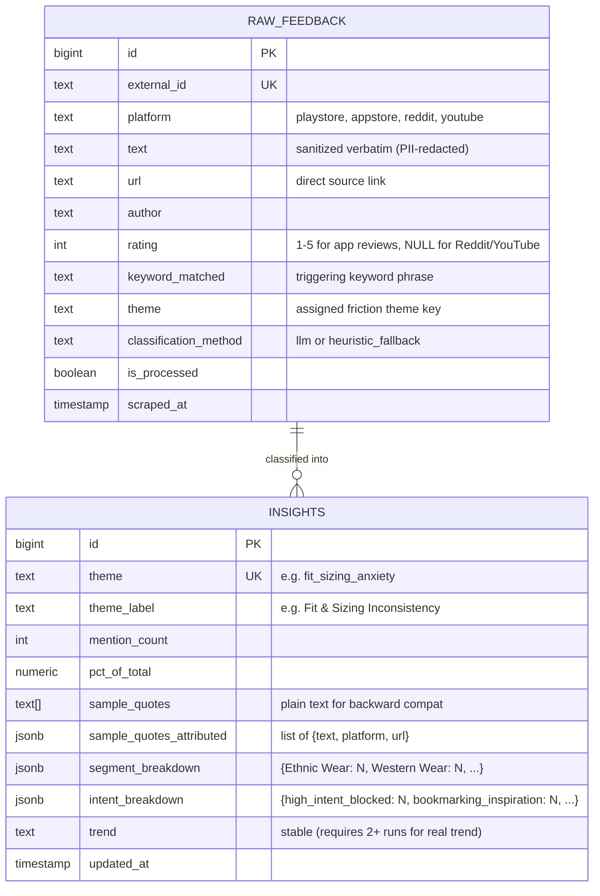

# AI-Powered Discovery Engine: System Architecture

---

## 1. Architectural Vision & Scope

The Discovery Engine is a backend analysis and insight-generation system that processes unstructured Voice of Customer (VoC) data from four specific public channels. Its sole purpose is to convert raw user conversations into structured, evidence-backed insights about why users save fashion items to their Myntra wishlists but don't purchase within 30 days.

### 1.1 Core Constraints
- **Allowed Data Sources**: Apple App Store (RSS), Google Play Store, Reddit (via Apify), YouTube Comments.
- **Text-Data Only**: The system processes exclusively textual data. No audio, images, or video frames are processed.
- **Strictly Discovery**: Extracts behavioral barriers, unmet needs, and decision friction. Does not generate end-user features.
- **Evidence Traceability**: Every insight maintains a verifiable link back to the raw source, including platform name and source URL.
- **Zero Monetary Incentives**: Focuses on non-monetary barriers — sizing, fabric, photo-reality gaps, social validation, occasion timing.

---

## 2. End-to-End Analysis Pipeline

The system is a sequential, multi-stage data processing pipeline.

```mermaid
flowchart TD
    subgraph Stage1["1. Source Ingestion Layer"]
        A1["Apple App Store RSS (India, pages 1-10)"]
        A2["Google Play Store (google-play-scraper, NEWEST + MOST_RELEVANT sort)"]
        A3["Reddit (Apify trudax/reddit-scraper + apify/reddit-scraper — real posts & comments)"]
        A4["YouTube (youtube-comment-downloader, Myntra haul/review videos)"]
    end

    subgraph Stage2["2. Preprocessing & Sanitization"]
        B1["PII Redaction (phone, order IDs, email)"]
        B2["Text Length Bounds (20-1500 chars)"]
        B3["Multi-Token Keyword Filter (avoids false positives like 'returns are fast!')"]
    end

    subgraph Stage3["3. Relevance Gate"]
        C1["Keyword Pair Matching: wishlist, size chart, fabric quality, see through, etc."]
        C2["Deleted/removed post filtering"]
        C3["In-memory deduplication by external_id before DB write"]
    end

    subgraph Stage4["4. AI Classification Engine"]
        D1["Primary: Groq Llama 3.3-70B (structured JSON output, temperature=0.05)"]
        D2["Quote Fabrication Check (extracted quote must appear in source text)"]
        D3["Fallback: NLP Heuristic Classifier (keyword proximity matching)"]
        D4["Default: unrelated_other (not an arbitrary friction theme)"]
    end

    subgraph Stage5["5. Thematic Aggregation"]
        E1["7 Canonical Friction Themes + 1 Noise Bucket"]
        E2["Intent Type Classification (high_intent_blocked, bookmarking_inspiration, etc.)"]
        E3["Category Segmentation (Ethnic, Western, Dresses, Footwear, General)"]
        E4["Sample Quote Attribution (text + platform + URL)"]
    end

    subgraph Stage6["6. Output & Dashboard"]
        F1["Supabase insights table (mention_count, pct_of_total, sample_quotes, segment_breakdown)"]
        F2["Next.js Dashboard (Vercel) with platform-attributed verbatim evidence"]
        F3["AI PM Copilot (Groq-grounded, zero hardcoded responses)"]
    end

    Stage1 --> Stage2
    Stage2 --> Stage3
    Stage3 --> Stage4
    Stage4 --> Stage5
    Stage5 --> Stage6
```

---

## 3. Component Details

### 3.1 Source Collection Layer

| Source | Method | Scope |
|---|---|---|
| **Play Store** | `google-play-scraper` (direct, no Apify) | NEWEST + MOST_RELEVANT sort, up to 4,000 reviews per sort |
| **App Store** | Apple iTunes RSS Feed (India store, pages 1–10) | Most recent ~500 reviews, handles 404 end-of-pages gracefully |
| **Reddit** | Apify `trudax/reddit-scraper` + `apify/reddit-scraper` | Real post bodies + top 10-15 comments per post from Indian fashion subreddits |
| **YouTube** | `youtube-comment-downloader` library | Top 100 comments per video, up to 12 Myntra haul/review videos |

### 3.2 Preprocessing & Keyword Filter

**PII Scrubbing** (applied before DB write):
- Indian mobile numbers: `\+?[6-9]\d{9}` → `[PHONE]`
- Myntra order IDs: `OD\d{9,}` → `[ORDER_ID]`
- Email addresses → `[EMAIL]`

**Multi-Token Keyword Filter** prevents false positives:
- ❌ Single token `"return"` would match: *"Returns are hassle-free!"* (false positive)
- ✅ Multi-token `"had to return"` correctly filters for friction signals
- Requires meaningful phrases like `"size chart"`, `"true to size"`, `"fitting tight"`, `"see through"`, `"fabric quality"`

### 3.3 AI Classification Engine

**Primary: Groq Llama 3.3-70B**
- `temperature=0.05` for high consistency
- Strict JSON schema with `response_format={"type": "json_object"}`
- **Quote Fabrication Check**: extracted quote verified as substring of source text before storage
- Exponential backoff retry (3 attempts) with graceful fallback

**Fallback: NLP Heuristic Classifier**
- Ordered rule-based matching on keyword proximity
- **Default is `unrelated_other`** — NOT an arbitrary friction theme
- This prevents inflating any theme's counts with ambiguous or noisy reviews

**Why no Vector DB / HDBSCAN in MVP?**
The architecture originally considered semantic embedding + HDBSCAN clustering. For the MVP scope, a pre-defined 7-theme taxonomy with LLM classification was chosen because:
1. Fixed taxonomy ensures interpretable, auditable percentages
2. Zero additional infrastructure cost (no ChromaDB/Qdrant needed)
3. LLM with few-shot examples matches or exceeds HDBSCAN's cluster labeling quality at this scale
4. Future iteration can add embeddings to validate/discover new themes dynamically

### 3.4 Intent Type Classification

Unlike simple sentiment analysis, the engine distinguishes WHY the user saved an item:

| Intent Type | Meaning |
|---|---|
| `high_intent_blocked` | User wants to buy but is blocked by uncertainty |
| `comparison_shortlisting` | User is comparing multiple options |
| `occasion_waiting` | User will buy when a specific event arrives |
| `price_monitoring` | User watches for a price drop |
| `bookmarking_inspiration` | Saved for inspiration, low purchase intent |
| `no_clear_intent` | Intent cannot be determined |
| `noise` | Unrelated to wishlist or purchase decision |

---

## 4. Data Storage & Traceability Architecture

**Traceability guarantee**: Every verbatim quote displayed in the dashboard includes `platform` (Play Store/App Store/Reddit/YouTube) and `url` (direct link to the source review or post).

---

## 5. Automation (GitHub Actions)

Daily cron at 03:00 UTC (08:30 AM IST):
1. **Secret validation** — fails fast if any required key is missing
2. **Multi-source ingestion** — all 4 sources in one run
3. **AI normalization** — runs with `if: always()` so partial ingestion success is still processed
4. **Supabase keepalive** — daily writes prevent free-tier project auto-pause

---

## 6. Output Interface (PM Discovery Dashboard)

Live at Vercel (`*.vercel.app`). Provides:

1. **Executive KPI Cards**: Live VoC record count, top 3 friction share, data sources
2. **Quantified Friction Taxonomy**: Ranked friction themes with percentage bars, click to expand
3. **Verbatim Evidence Panel**: Real customer quotes with platform badge + source link
4. **Category Distribution**: Friction signal breakdown by fashion category (Ethnic/Western/Dresses/Footwear)
5. **AI PM Discovery Copilot**: Chat interface grounded strictly in live Supabase data (no hardcoded responses)
6. **Top 3 Drop-Off Drivers**: High-priority themes with non-monetary product lever recommendations
7. **Evidence Transparency Note**: Clearly labels all insights as AI-inferred hypotheses for user research validation
