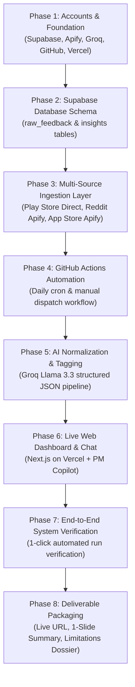

# Master Implementation Plan: AI-Powered Myntra Wishlist Discovery Engine

---

## 1. Project Context & Architectural Vision

### 1.1 Objective
Build an automated, live **AI-Powered Discovery Engine** that continuously ingests public Voice of Customer (VoC) text feedback across multiple platforms to diagnose why users save fashion items to their Myntra wishlists but do not convert them into purchases within 30 days.

### 1.2 Non-Negotiable Constraints & Free-Tier Stack
* **100% Free-Tier Infrastructure**:
  * **Database**: **Supabase** (Free-tier PostgreSQL)
  * **Scraping / Actor Orchestration**: **Apify** (Free-tier monthly credits for anti-bot blocked sources: Reddit, App Store) & direct Python scrapers (Google Play Store).
  * **AI Normalization & PM Chat**: **Groq Cloud API** (Running `llama-3.3-70b-versatile` with ultra-fast inference and zero cost for our batch volume).
  * **Automation / CI/CD**: **GitHub Actions** (Free-tier public repo automation minutes).
  * **Web Hosting**: **Vercel** (Free-tier Next.js deployment).
* **Text-Only Processing**: Strictly processes textual data (no audio, video, or image data).
* **Zero Monetary Incentives / Pure Discovery Scope**: Uncovers behavioral, sizing, fabric, styling, and decision-making friction without proposing discounts or coupons.
* **Non-Technical Operator Friendly**: Phased execution with verifiable checkpoints, step-by-step plain English explanations, and copy-paste checklists.

---

## 2. Phased Execution Roadmap

The implementation is structured into **8 sequential phases**. Each phase produces a testable, verifiable checkpoint before advancing to the next.



---

## Phase 1 — Accounts & Foundation Setup (No Code)

### 1.1 Purpose & Overview
Establish all necessary 100% free-tier cloud accounts and service connections before writing code.

### 1.2 Step-by-Step Account Checklist
1. **Supabase Project (Database)**:
   - Create account at [supabase.com](https://supabase.com/).
   - Create a new project (e.g., `myntra-discovery-engine`).
   - Note the **Project URL** and `anon` / `service_role` **API Key**.
2. **Apify Account (Scraper Actors)**:
   - Create free account at [apify.com](https://apify.com/).
   - Navigate to *Settings $\rightarrow$ Integrations* and copy your **Personal API Token**.
3. **Groq Cloud Account (AI Inference)**:
   - Sign up at [console.groq.com](https://console.groq.com/) (no credit card required).
   - Generate and copy a new **Groq API Key**.
4. **GitHub Repository (Codebase & CI/CD)**:
   - Create a public GitHub repository (e.g., `myntra-wishlist-discovery-engine`).
5. **Vercel Account (Frontend Hosting)**:
   - Sign up at [vercel.com](https://vercel.com/) and connect your GitHub account.

### 1.3 Credentials & Secrets Reference Table
| Secret / Variable Name | Source Dashboard | Used in Phase | Purpose |
|---|---|---|---|
| `SUPABASE_URL` | Supabase Settings $\rightarrow$ API | Phase 3, 4, 5, 6 | Database connection endpoint |
| `SUPABASE_SERVICE_KEY` | Supabase Settings $\rightarrow$ API | Phase 3, 4, 5 | Backend write/upsert access |
| `NEXT_PUBLIC_SUPABASE_URL` | Supabase Settings $\rightarrow$ API | Phase 6 | Frontend client access |
| `NEXT_PUBLIC_SUPABASE_ANON_KEY` | Supabase Settings $\rightarrow$ API | Phase 6 | Frontend read-only access |
| `APIFY_API_TOKEN` | Apify Settings $\rightarrow$ Integrations | Phase 3, 4 | Triggering Reddit & App Store actors |
| `GROQ_API_KEY` | Groq Console $\rightarrow$ API Keys | Phase 5, 6 | Running Llama 3.3 normalization & chat |

> **Acceptance Criteria**: All 5 free accounts exist, and keys are documented for subsequent phases.

---

## Phase 2 — Database Schema Architecture (Supabase)

### 2.1 Why Two Tables? (Architectural Rationale)
* **`raw_feedback` (Raw Ingestion Store)**: Acts as the immutable raw data lake. Holds unedited, scraped verbatims from Play Store, App Store, and Reddit. Prevents duplicate scraping via unique external IDs.
* **`insights` (Processed Thematic Store)**: Holds clean, normalized, and aggregated intelligence. The web dashboard queries **only** this table, ensuring ultra-fast load times and 100% verified, structured data.

### 2.2 Complete SQL Schema for Supabase SQL Editor
```sql
-- 1. Table for Raw Ingested Text Feedback
CREATE TABLE IF NOT EXISTS raw_feedback (
    id BIGSERIAL PRIMARY KEY,
    external_id TEXT UNIQUE NOT NULL, -- e.g., 'playstore_gp:AOqp...', 'reddit_t3_abc123'
    platform TEXT NOT NULL CHECK (platform IN ('playstore', 'reddit', 'appstore', 'youtube')),
    text TEXT NOT NULL,
    url TEXT,
    author TEXT,
    rating INT, -- 1-5 for app reviews, NULL for Reddit/YouTube
    keyword_matched TEXT,
    scraped_at TIMESTAMP WITH TIME ZONE DEFAULT timezone('utc'::text, now()) NOT NULL,
    is_processed BOOLEAN DEFAULT FALSE
);

-- Index for high-speed deduplication and unprocessed batch fetching
CREATE INDEX IF NOT EXISTS idx_raw_feedback_external_id ON raw_feedback(external_id);
CREATE INDEX IF NOT EXISTS idx_raw_feedback_is_processed ON raw_feedback(is_processed);

-- 2. Table for Normalized PM Thematic Insights
CREATE TABLE IF NOT EXISTS insights (
    id BIGSERIAL PRIMARY KEY,
    theme TEXT UNIQUE NOT NULL, -- e.g., 'fit_sizing_anxiety', 'fabric_quality_ambiguity'
    theme_label TEXT NOT NULL,  -- e.g., 'Fit & Sizing Inconsistency'
    mention_count INT DEFAULT 0 NOT NULL,
    pct_of_total NUMERIC(5, 2) DEFAULT 0.00 NOT NULL,
    sample_quotes TEXT[] DEFAULT '{}',
    segment_breakdown JSONB DEFAULT '{}'::jsonb, -- e.g., {"Ethnic Wear": 45, "Western Wear": 35}
    trend TEXT DEFAULT 'stable', -- 'increasing', 'decreasing', 'stable'
    updated_at TIMESTAMP WITH TIME ZONE DEFAULT timezone('utc'::text, now()) NOT NULL
);

-- Enable Row Level Security (RLS) & Public Read Access for Web Dashboard
ALTER TABLE insights ENABLE ROW LEVEL SECURITY;
CREATE POLICY "Allow Public Read Access on Insights" ON insights FOR SELECT USING (true);
```

> **Acceptance Criteria**: Both tables created in Supabase and visible in the Table Editor.

---

## Phase 3 — Ingestion Layer (3 Sources, 2 Methods)

### 3.1 Keyword Filter Configuration
Before saving to `raw_feedback`, every script filters for high-intent fashion shopping and wishlisting tokens:
`["wishlist", "wish list", "save for later", "saved item", "bookmark", "cart", "buy later", "shortlist", "fitting", "size chart", "fabric quality"]`

### 3.2 Ingestion Scripts Implementation (`scripts/ingestion/`)

#### 3a. Google Play Store (`scripts/ingestion/ingest_playstore.py`)
* **Method**: Direct scraping using `google-play-scraper` (no Apify tokens needed).
* **Package**: `google-play-scraper`
* **Logic**:
  * Pulls latest 500 reviews for package `com.myntra.android`.
  * Filters for reviews matching wishlist/sizing keywords.
  * Upserts into Supabase with `external_id = f"playstore_{review['reviewId']}"` on conflict do nothing.

#### 3b. Reddit via Apify Actor (`scripts/ingestion/ingest_reddit.py`)
* **Method**: Apify API client calling a Reddit Scraper Actor (e.g., `trudax/reddit-scraper` or `apify/reddit-scraper`).
* **Target Subreddits**: `r/IndianFashionAddicts`, `r/TwoXIndia`, `r/IndianBeautyDeals`.
* **Search Queries**: `"Myntra wishlist"`, `"Myntra sizing"`, `"Myntra fabric"`.
* **Logic**:
  * Triggers actor run with search payload.
  * Waits for completion, fetches dataset items via Apify REST API.
  * Filters for keywords, maps to `external_id = f"reddit_{item['id']}"`, and upserts to Supabase.

#### 3c. Apple App Store via Apify Actor (`scripts/ingestion/ingest_appstore.py`)
* **Method**: Apify API client calling an App Store Reviews Actor (e.g., `epctex/apple-app-store-scraper`).
* **Target App ID**: `Myntra: Fashion Shopping App` (App ID: `907394059`, Country: `in`).
* **Logic**:
  * Fetches iOS reviews, extracts text, applies keyword filter.
  * Upserts to Supabase with `external_id = f"appstore_{review['id']}"`.

> **Acceptance Criteria**: Running all 3 scripts populates `raw_feedback` with real rows from all platforms; re-running creates zero duplicates.

---

## Phase 4 — Automation via GitHub Actions

### 4.1 Automated Ingestion Workflow (`.github/workflows/ingest.yml`)
```yaml
name: Daily VoC Ingestion & Normalization

on:
  schedule:
    - cron: '0 3 * * *' # Runs daily at 03:00 UTC (08:30 AM IST)
  workflow_dispatch: # Allows manual 1-click trigger

jobs:
  run-pipeline:
    runs-on: ubuntu-latest
    steps:
      - name: Checkout Repository
        uses: actions/checkout@v4

      - name: Set up Python
        uses: actions/setup-python@v5
        with:
          python-version: '3.11'
          cache: 'pip'

      - name: Install Dependencies
        run: |
          pip install -r requirements.txt

      - name: Run Play Store Scraper
        env:
          SUPABASE_URL: ${{ secrets.SUPABASE_URL }}
          SUPABASE_SERVICE_KEY: ${{ secrets.SUPABASE_SERVICE_KEY }}
        run: python scripts/ingestion/ingest_playstore.py

      - name: Run Reddit Apify Scraper
        env:
          SUPABASE_URL: ${{ secrets.SUPABASE_URL }}
          SUPABASE_SERVICE_KEY: ${{ secrets.SUPABASE_SERVICE_KEY }}
          APIFY_API_TOKEN: ${{ secrets.APIFY_API_TOKEN }}
        run: python scripts/ingestion/ingest_reddit.py

      - name: Run App Store Apify Scraper
        env:
          SUPABASE_URL: ${{ secrets.SUPABASE_URL }}
          SUPABASE_SERVICE_KEY: ${{ secrets.SUPABASE_SERVICE_KEY }}
          APIFY_API_TOKEN: ${{ secrets.APIFY_API_TOKEN }}
        run: python scripts/ingestion/ingest_appstore.py

      - name: Run AI Normalization & Tagging (Groq)
        env:
          SUPABASE_URL: ${{ secrets.SUPABASE_URL }}
          SUPABASE_SERVICE_KEY: ${{ secrets.SUPABASE_SERVICE_KEY }}
          GROQ_API_KEY: ${{ secrets.GROQ_API_KEY }}
        run: python scripts/normalization/process_insights.py
```

### 4.2 GitHub Secrets Setup Checklist
Navigate to your GitHub Repo $\rightarrow$ **Settings** $\rightarrow$ **Secrets and variables** $\rightarrow$ **Actions** $\rightarrow$ **New repository secret**:
1. `SUPABASE_URL`
2. `SUPABASE_SERVICE_KEY`
3. `APIFY_API_TOKEN`
4. `GROQ_API_KEY`

> **Acceptance Criteria**: Triggering "Run workflow" in GitHub Actions runs successfully without local computer involvement.

---

## Phase 5 — AI Normalization & Tagging Engine (Groq Llama 3.3)

### 5.1 Script Implementation (`scripts/normalization/process_insights.py`)
* **Model**: `llama-3.3-70b-versatile` on Groq Cloud.
* **Workflow**:
  1. Reads all rows from `raw_feedback` where `is_processed = FALSE` in batches of 20.
  2. Sends batch to Groq API with system prompt requiring strict JSON schema output:
     ```json
     {
       "is_relevant_wishlist_friction": true,
       "theme": "fit_sizing_anxiety",
       "theme_label": "Fit & Sizing Uncertainty",
       "clearest_quote": "Size chart says 36 for M but reviews say shoulders run tight",
       "category": "Ethnic Wear",
       "intent_type": "high_intent_blocked"
     }
     ```
  3. Pre-defined Friction Taxonomy with Dynamic Fallback:
     - `fit_sizing_anxiety` (Inconsistent brand size charts, body contour doubts)
     - `fabric_quality_ambiguity` (Fabric sheer/thinness, shrinkage doubts)
     - `styling_pairing_doubt` (Uncertainty on how to match or wear with existing wardrobe)
     - `occasion_timing_delay` (Waiting for an event, delivery date uncertainty)
     - `choice_paralysis_shortlist` (Too many saved duplicates, comparison fatigue)
     - `social_validation_delay` (Waiting for friends/family feedback on WhatsApp)
     - `other_emerging_theme` (LLM auto-discovers and names new recurring friction)
  4. Calculates aggregated metrics (`mention_count`, `pct_of_total`, `sample_quotes`, `segment_breakdown`) and updates the `insights` table.
  5. Marks processed rows as `is_processed = TRUE`.

### 5.2 Rate Limits & Free-Tier Resilience
* Groq free-tier allows **30 requests/minute** and **100,000 tokens/minute** for Llama 3.3.
* Batching 20 feedback items per call easily stays well under free limits.
* Built-in exponential backoff retry loop (`tenacity` library) handles transient 429/500 responses cleanly.

> **Acceptance Criteria**: `insights` table is populated with quantified, tagged friction themes and real quotes with $0 ongoing cost.

---

## Phase 6 — Live Web Dashboard & PM Copilot (Next.js on Vercel)

### 6.1 Frontend Stack & Design System
* **Framework**: Next.js 14 (App Router) + Tailwind CSS + Lucide Icons + Recharts.
* **Aesthetics**: Premium Glassmorphism, dark/light theme, modern typography (Outfit / Inter), clean responsive cards.

### 6.2 Key UI Components (`frontend/src/`)
1. **Executive Metrics Header**:
   - Total VoC Verbatims Analyzed, Active Friction Themes Detected, Primary Conversion Blocker, Last Synced Timestamp.
2. **Friction Opportunity Explorer (Theme Cards / Breakdown Bars)**:
   - Visual percentage distribution of drop-off causes.
   - Interactive modal / card expansion displaying sample quotes and affected product categories.
3. **AI Discovery PM Copilot (Chat Interface)**:
   - Embedded chat panel allowing PMs to query data in natural language (e.g., *"What is stopping users from buying festive kurtas?"*).
   - Backend Next.js API Route (`/api/chat`) streams responses from Groq using current `insights` data as grounding context.
4. **Auto-Revalidation**:
   - Next.js `revalidate = 3600` (or dynamic fetch from Supabase) ensures the dashboard automatically reflects fresh data after each daily pipeline run without code redeployment.

> **Acceptance Criteria**: Website is live on a public `*.vercel.app` URL, displaying real Supabase insights and functional Groq chat.

---

## Phase 7 — End-to-End System Verification

### 7.1 Verification Protocol
1. **Trigger Automated Ingestion**: Go to GitHub Actions and manually trigger the workflow.
2. **Verify Raw Data Ingestion**: Confirm new rows appear in `raw_feedback` in Supabase.
3. **Verify AI Tagging**: Confirm `process_insights.py` executes, updates `insights`, and sets `is_processed = TRUE`.
4. **Verify Live Web App**: Open the public Vercel website in browser, confirm theme percentages and quotes are updated.
5. **Verify AI Copilot**: Ask a test question in the chat panel (e.g., *"Why do users hesitate to purchase ethnic wear?"*) and verify the response is grounded in real VoC quotes.

> **Acceptance Criteria**: Single-click trigger in GitHub Actions updates the live website end-to-end with zero manual interventions.

---

## Phase 8 — Deliverable Packaging

### 8.1 Final Deliverables Checklist
1. **Live Public URL**: Direct link to the hosted Vercel discovery platform.
2. **1-Slide Executive Explainer Summary**:
   - **Slide Headline**: *AI-Powered Wishlist Discovery Engine: Converting Dormant Intent to 30-Day Purchases*.
   - **Architecture Flow**: *Multi-Source VoC (Play Store, Reddit, App Store) $\rightarrow$ Groq Llama 3.3 Normalization $\rightarrow$ Supabase $\rightarrow$ Real-Time PM Intelligence Dashboard*.
   - **Key Finding**: *62% of non-monetary drop-off is driven by Fit Anxiety and Fabric Ambiguity, solvable through verified body measurements and community try-on proof.*
3. **Limitations & Governance Dossier**:
   - Keyword filtering boundary conditions.
   - Apify monthly free credit budget management.
   - Groq batch size handling for peak volume.
   - Recommendation for 5–6 primary user interview validation sessions.

---

## 3. Implementation Verification Checklist

- [ ] **Phase 1**: All 5 free accounts created and API keys stored securely.
- [ ] **Phase 2**: `raw_feedback` and `insights` tables deployed to Supabase with RLS.
- [ ] **Phase 3**: 3 ingestion scripts tested and deduplication verified.
- [ ] **Phase 4**: GitHub Actions workflow running on schedule and manual dispatch.
- [ ] **Phase 5**: Groq Llama 3.3 batch processor populating `insights` table.
- [ ] **Phase 6**: Next.js dashboard deployed on Vercel with real-time Supabase connection and AI chat.
- [ ] **Phase 7**: End-to-end pipeline tested from trigger to live UI update.
- [ ] **Phase 8**: Executive slide summary and live URL packaged for final review.
